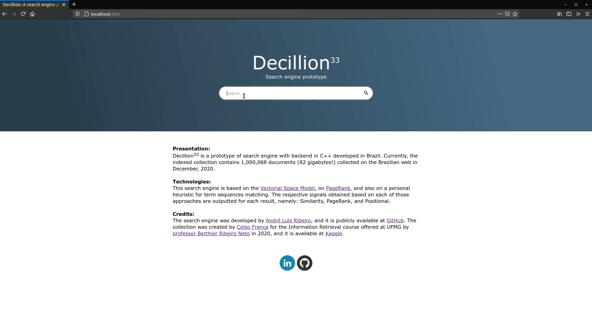
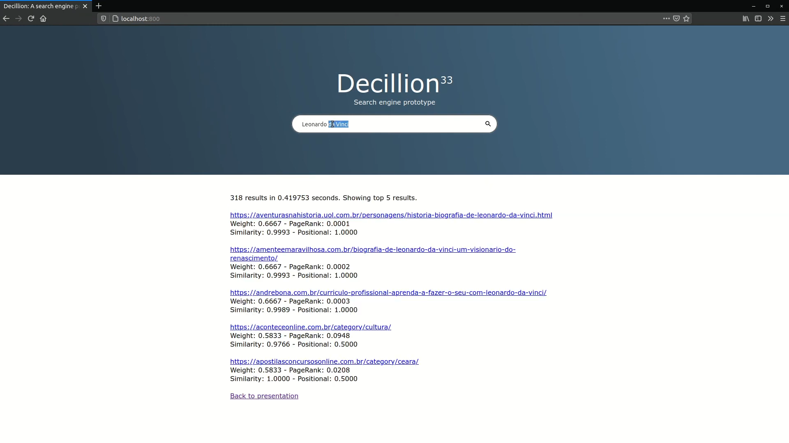

# Decillion: Search engine prototype
This repository contains the source of the Decillion³³ project, a non-commercial search engine prototype. Currently, it has three modules: a multi-thread crawler focused on the Brazilian web, an indexer based on inverted lists, and the search engine.

Decillion is able to efficiently collect pages across the web, index those pages, and search across them. The three modules have been tested with 1 million + documents.

Presentation of the search engine: https://youtu.be/NUEC790Zv2I

  <kbd>
    
  </kbd>
    
  <kbd>
    
  </kbd>

