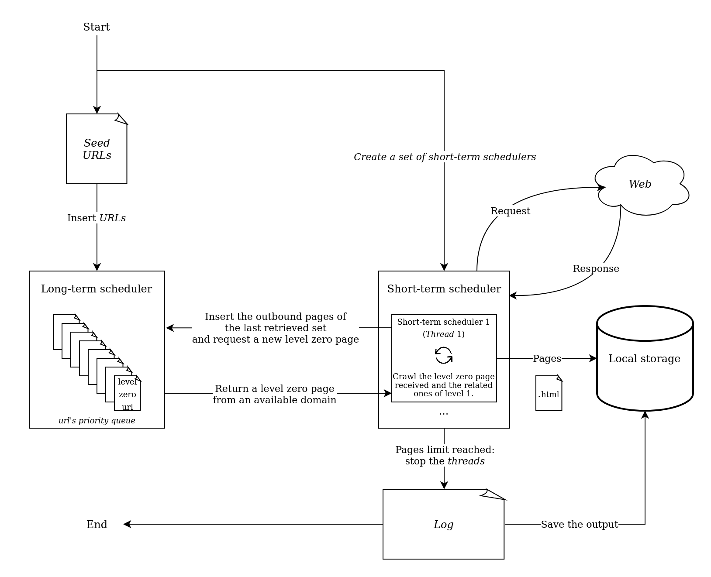

# Decillion Web Crawler
This is a multithreaded web crawler designed for collecting pages from the web in a horizontal way, i.e., giving priority to the exploration of different domains. This crawler was tested on up to 1 million pages, collected from the Brazilian Web.

## Dependencies
Decillion Crawler makes use of the [Chilkat Spider class](https://www.chilkatsoft.com/refdoc/vcCkSpiderRef.html). Therefore, the installation of the Chilkat library is required for running this crawler. You must also reference the installation folder on the makefile, changing the macro "CHILKAT".

## Compiling and running
After obtaining a copy of Chilkat, you can compile the crawler through the command:

```make```

For running in default mode, simply use:
    
```make run```

A series of parameters can also be used to control the program:

```make run seed="seeds" threads="50" limit="10000" individual_files="false"```

* The "seed" parameter refers to a file with the URLs where the crawler should begin its exploration. All outbound links of those pages will be added to a priority queue (the long-term scheduler), which will be used for further exploration. The default is a file named "seeds" on the root folder.
* The "thread" parameter refers to the number of threads to be used during the exploration. Be aware that both the speed and the computational cost of the procedure are directed related to it. The default is 50.
* The "limit" parameter refers to the maximum number of pages to be crawled. This version was tested with up to 1m pages. The limit also influences the computational cost as there is no control of the size of the queue currently. Initial tests have shown that collecting 1m pages might need up to 5GB RAM, but this is strongly related to the pages your exploration will reach. The default is 100,000.
* The "individual_files" parameter allows you to control the output of the crawler. Setting it to "false" will generate a jsonl where each line contains the HTML content, title and URL of a collected page. Setting it to "true" will generate one file in the "data" folder for the HTML of each file collected and also one file on the "links" folder with its URL. It is strongly recommended to set it to "false" due to efficiency reasons. Default is "false".

By default, the output of the program will be redirected to the "data/log" file.

Note: Currently, you must use "make run" with either no parameters or all parameters (seed, threads, limit and individual_files). 

## Crawler architecture

The architecture of this crawler includes a long-term scheduler, responsible for defining the next pages to be crawled and for storing potential pages, and a short-term scheduler, responsible for requesting a page for the long-term scheduler and for exploring its content and links. Only links of the same domain directly linked to the page received are explored by the short-term scheduler. Outbound links are put on the long-term queue.



The politeness policy of this crawler ensures that two or more crawlers will never simultaneously explore the same domain, that a page will never be collected twice, and that a delay will be given between requests for the same domain. Also, Chilkat is expected to already respect all robots.txt files.

Final notes: 
* This crawler will prioritize Brazilian pages.
* Tested on Ubuntu 18.04.
* Collecting 10,000 pages takes ~4 minutes. 100,000, ~40 minutes. 1 million, ~7 hours. The time you will take depends on the speed of your internet connection and of your computer!